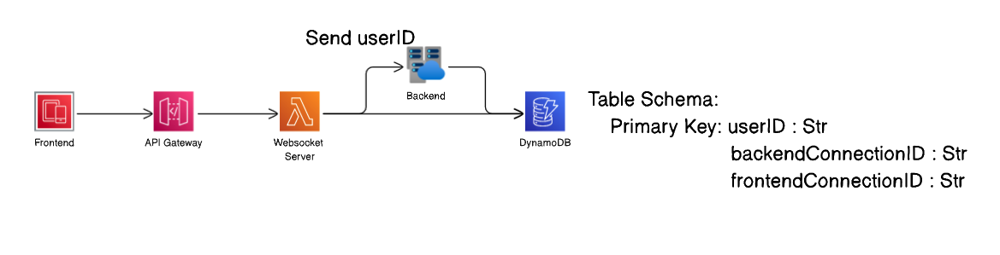
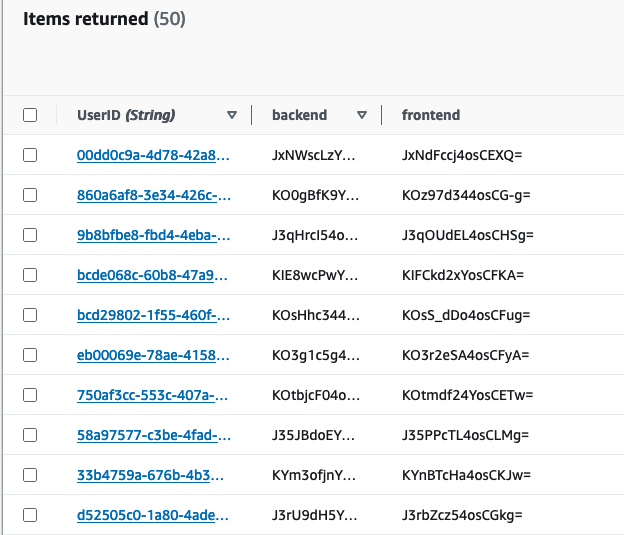
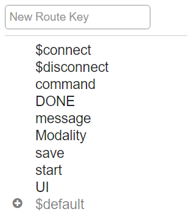

# HippoGym
## Human Input Parsing Platform for OpenAI Gym

### Table of Contents
1. [Purpose](#Purpose)
2. [System Overview](#System-Overview)
    - [WebSockets](#Websockets)
    - [System Architecture](#System-Architecture)
    - [RouteKeys](#RouteKeys)
    - [AWS Lambda Middleware](#AWS-Lambda-Middleware)
    - [CCC](#the-concurrent-connection-collision-problem-ccc)
3. [Setting Up](#Setting-Up)
    - [Frontend Setup](#Frontend-Setup)
    - [Backend Setup](#Backend-Setup)
4. [Contributors](#Contributors)

## Purpose
HippoGym is a Python library designed for researchers and students focusing on human-AI interaction over the web. It simplifies the setup, execution, data collection, and management of experiments by providing an easy-to-use interface for [OpenAI Gym](https://gym.openai.com/) and supports custom built environments.


## System Overview
### Websockets
The [Websocket API](https://docs.aws.amazon.com/apigateway/latest/developerguide/apigateway-websocket-api.html) by [Amazon Web Services](https://aws.amazon.com/) (AWS) provides the backbone for real-time, bi-directional communication between the client and the server in HippoGym. Specifically, it facilitates seamless interaction between the frontend, written in React, and the backend `trial.py` logic. The `WebSocket` class, part of the backend architecture, abstracts away the complexity of Websocket communications, allowing users to focus on human-AI interaction research.

In HippoGym, Websocket API enables:
- Real-time updates: For example, rendering frames in OpenAI Gym environments.
- Data Exchange: Messages containing experiment data are exchanged between the frontend and backend.
- Data saving: Enabling the real-time saving of step/trial data, which can then be fed into an external learning algorithm for further use. 

With Websockets, you can easily send messages from the frontend to the backend and vice versa without worrying about the underlying communication protocols.


### System Architecture
The architecture operates in the following sequence:
1. **Front-end Deployment**: Projects are deployed using React, then it can be accessed on the web for a user to connect to.
2. **Backend Connection**: Users run their custom `trial.py` after reading through the step files and before you enter the game page. 
3. **AWS Lambda**: The backendConnectionID is held in AWS Lambda server awaiting for the frontend to map to the backend.
4. **Front-end Launch**: On game launch, the frontend connects to the WebSocket server, sends a unique userID and sends the request to map the user with the backend.
5. **UserID Storage**: AWS Lambda stores the userID in a DynamoDB table for unique mapping.

This architecture ensures unique mapping and seamless communication between frontend and backend.
See below to get a brief overview of the current system design for connecting a client: 



An example of how users appear on DynamoDB is shown: 



Sometimes, clashes arise - please see [The Concurrent Connection Clash Problem](#the-concurrent-connection-collision-problem-ccc) to learn how to avoid this problem.

## RouteKeys
Route keys serve as a routing mechanism in AWS Websocket API. A message must specify a route key to route it to the correct Lambda function. 

Example data:
```json
{
  "routeKey": "save",
  "data": 
    {
        'timestep': 0,
        'state': 1,
        'action': 'left'
    }
  
}
```

*Note routeKey is case sensitive* 

Here are the current route keys we have available:



When sending a message from either frontend or backend, we must specify a route key from this list, along with any type of data we wish to send over. For more on sending and receiving messages, see [Setting Up](#setting-up).


## AWS Lambda Middleware
We use AWS Lambda as middleware for routing our Websocket messages to the relevant service. Lambda detects which user is sending a message, and where its intended destination is, that be frontend or backend. The displayed route keys above route to our Lambda Websocket handler in which the Lambda reads the route key and the target endpoint.

## The Concurrent Connection Collision Problem (CCC)
The Concurrent Connection Clash (CCC) Problem can can arise from the manner in which AWS Lambda handles connections. The CCC Problem emerges when users initiate backend and frontend connections in rapid succession. If a subsequent user's frontend connection occurs before the previous user's frontend connection, unintended session merging can happen.

In the scenario where User 1's backend and User 2's backend connections occur in quick succession, followed by User 1's frontend and User 2's frontend connections, the issue arises. Due to the way our system handles connections, the backend connections of User 2 and frontend connection of User 1 unexpectedly merge. This unintended merging can lead to disruptions in loading and communication.

This behavior is attributed to AWS Lambda, which holds backend connections until the corresponding frontend connects. If a newer backend connection arrives before the intended frontend, the Lambda prioritizes the most recent backend connection, causing unexpected results.

To prevent the CCC Problem, it's advised that users connect their backend and frontend components in quick succession, ideally right before the frontend loads. By ensuring the backend connection precedes the frontend connection, the likelihood of timing-related clashes is minimized.

## Setting Up
### Frontend Setup

Let’s dive into our React code to get a brief overview of we setup the frontend. In this use case, we will be providing code snippets used for the [Mountain Car](https://www.gymlibrary.dev/environments/classic_control/mountain_car/) environment from OpenAI Gym. 

If you wish to make adjustments to the frontend, you may enter the [HIPPO_Gym_FrontEnd_React repo](https://github.com/IRLL/HIPPO_Gym_FrontEnd_React) and clone it as usual. You cd into the repository and run `npm install` to install the dependencies required for the frontend to work. Once you are in there, navigate to the `game.js` file found in HIPPO_Gym_FrontEnd_React/src/components/Game/game.js. For those curious you can always do a stack trace from main.js to explore all components of the frontend. Once you visit the game.js, most if not all of the code is under the main class of Game, here we define our initial states, components, props and more of what React has to offer. You may notice how one of the methods inside this Game class defines how we send messages to our Websocket. The exact code can be viewed here. 

```javascript
   // Send data to websocket server in JSON format
   sendMessage = (routeKey, data) => {
       // action is added to indicate the routeKey for the backend.
       if (this.state.isConnection){
           this.websocket.send(JSON.stringify({
               action: routeKey,
               userId: USER_ID,
               sendTo: "backend",
               ...data
               }));
       }    
   };

```
If you aren’t familiar with hashmaps, don’t worry about how this works; but rather understand that every time we reference this function inside our game.js, we reference it as `this.sendMessage(“routeKey”, {data: wishToSend}`. An example usage for this is shown bellow, where we send a message under the “start” routeKey to trigger the userID dynamoDB update process. We first define our routeKey = “start”, and then use a hashmap to send whatever form of data we want (we chose userID and projectID here). This part is standard start in all experiments and will be done for you in the boilerplate code. We typically run this code after we establish a valid connection to our Websocket server.

```javascript
this.sendMessage("start",{
             userId: USER_ID,
             projectId: PROJECT_ID,
         });

```

After we run the code above, the expected output we receive is as follows: ```{'userId': <userID>, 'projectId': <projectID>}``` and the raw json gets parsed through our Lambda handler and notifies the backend of our userID and projectID for the given experiment.


Now that you have gotten an example of how to send messages to our Websocket, let's look at how we can receive expected messages as well. With every experiment, we want to render our UI for the frontend to be able to visualize a dynamic page. Usually our backend handles rendering the frames/displaying some sort of UI; whether that is passing in components for button data, or full scale environment npArray render frames provided from OpenAI Gym. See the example code below:

```javascript
this.websocket.onmessage = (message) => {
          if (message.data === "done") {
            //"done" means the game has ended
            this.setState({
              isEnd: true,
              gameEndVisible: true,
            });
          } else {
            //parse the data from the websocket server
            let parsedData = JSON.parse(message.data);
            //Check if frame related information in ws message
            if (parsedData.env.frame && parsedData.env.frameId) {
                let frame = parsedData.env.frame;
                let frameId = parsedData.env.frameId;
                // **Optionally set a new border color
                if ("borderColor" in parsedData) {
                    this.setState({
                    borderColor: parsedData.borderColor,
                    });
                }
                this.setState((prevState) => ({
                  // set new frame ID
                  frameSrc: "data:image/jpeg;base64, " + frame,
                  frameCount: prevState.frameCount + 1,
                  frameId: frameId,
                }));

```

In the code above, we listen to any incoming Websocket messages and parse the data from the message. If the Websocket message sent from our backend contains the data:

```python
{'routeKey' = 'UI',
    {'env':
        {'frame': <frameData>,
         'frameId': <frameId>
        }
    }
}
```
then the code above will be executed. Notice how we use the routeKey here as UI, and the data we send can be anything, or in this case; a nested dictionary. You may have also noticed that we check the Websocket to see if the Websocket message has the keyword done - that is the logic to end the game. 

We will explore more on how the backend sends this env frame data to the frontend. We have now fully gone over how the frontend sends and receives data from a backend client now.


### Backend Setup
Now it's time to look into the backend; the heart of the experiment lies in the `trial.py` file. 
The file defines a Trial class to run an experimental trial that interacts with a WebSocket server through `websocket.py` and an environment provided by an `agent.py` Agent class. 
It also has functionalities like configuring the trial tailored to your needs, handling incoming messages, and extracting data.

### Step-by-step Instructions

1. **Clone the Repository**
    ```bash
    git clone https://github.com/IRLL/HIPPO_Gym.git
    ```
2. **Install Dependencies**
    ```bash
    pip install -r requirements.txt
    ``` 
3. **Navigate to Directory**
    ```bash
    cd App
    ```
4. **Run the Program**
    ```bash
    python3 trial.py
    ```

trial.py is the most important aspect of HippoGym, as it allows you to custom tailor your experiment to exactly how you desire.

Usually in the `__init__` method is where researchers tend to specify their preferred experiment configuration:

```python
class Trial():
    def __init__(self):
        print(f'{TAG} Initializing Trial...')
        self.config = load_config() # ability to load logic data from config file
        self.data = None
        self.count = 1
        self.websocket = Websocket() # If you wish to specify your own websocket server use it as param
        self.episode = 0
        self.done = False
        self.play = False
        self.nextEntry = {}
        self.outfile = None
        self.userId = None
        self.show_demo = None
        self.total_reward = 0
        self.demo_idx = 0
        self.modality = self.config.get('modality')
        self.framerate = self.config.get('startingFrameRate', 30)
        self.frameId = 0
```
If we are using HippoGym for Mountain Car Environment specifically, the trial.py will be mostly configured for us.

Let's take a look at how we send messages using our abstracted Websocket class. Remember the frontend setup where we expected to receive some environment renders? Well, this is how we are sending it in the backend:

```python
    async def send_render(self, render:dict):
        await self.websocket.sendData('UI', {'env':render})
```

We utilize this websocket.sendData() method that is defined as follows from our `websocket.py` code, although we don't have to worry about this:

```python
    async def sendData(self, routeKey, data):
        if self.websocket is not None:
            ws_data = {"action": routeKey, "userId": self.userID, "sendTo": "frontend"}
            ws_data.update(data)
            await self.websocket.send(json.dumps(action_data))
```

so the data format is sent to the frontend as follows:

```python
{'routeKey' = 'UI',
    {'env':
        {'frame': <frameData>,
         'frameId': <frameId>
        }
    }
}
```
Exactly how we wish it to be sent.


Now, to receive messages from Websocket, we continuously listen for messages while the trial is not marked as done, 
and send messages to a function to parse the data accordingly.

```python
    async def run(self):
        '''
        This is the main event controlling function for a Trial.
        It handles the render-step loop
        '''
        while not self.done:
            message = await self.websocket.receiveData()
            # Message is received from Websocket in JSON Format
            await self.handle_message(message)
```
In the handle_message function, we have the flexibility to define the approach for processing the received messages. 

If you are curious further about the backend configuration, more specifically how `agent.py` and `websocket.py` is configured, you can read through the documented source code.


## Contributors
Originally written by [Nick Nissen](https://nicknissen.com) and Yuan Wang

System upgrades and redesign by [Mohamed Al-Nassirat](https://www.linkedin.com/in/mohamed-al-nassirat-6893b9203/?originalSubdomain=ca) and [Vera Maoued](https://github.com/vmaoued) 

Supervised by [Matt Taylor](https://drmatttaylor.net)
For the Intelligent Robot Learning Laboratory [(IRLL)](https://irll.ca) at the University of Alberta [(UofA)](https://ualberta.ca)
Supported by the Alberta Machine Intelligence Institute [(AMII)](https://amii.ca)

