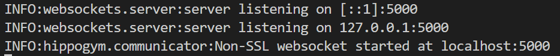
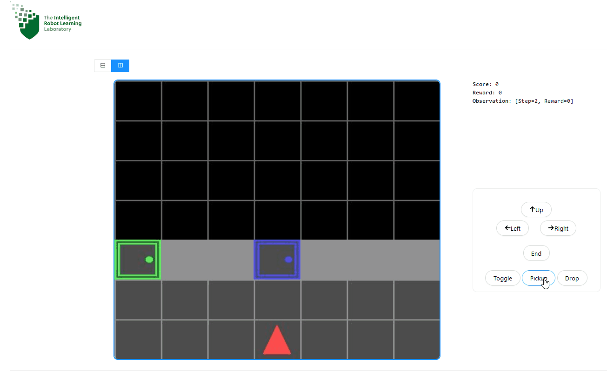

# HippoGym

##### Human Input Parsing Platform for Openai Gym

[](https://badge.fury.io/py/hippogym)
[](https://pepy.tech/project/hippogym)
[](https://pepy.tech/project/hippogym)

[](https://www.codacy.com/gh/IRLL/HIPPO_Gym/dashboard?utm_source=github.com&amp;utm_medium=referral&amp;utm_content=IRLL/HIPPO_Gym&amp;utm_campaign=Badge_Grade)
[](https://www.codacy.com/gh/IRLL/HIPPO_Gym/dashboard?utm_source=github.com&amp;utm_medium=referral&amp;utm_content=IRLL/HIPPO_Gym&amp;utm_campaign=Badge_Coverage)
[](https://github.com/psf/black)
[](https://github.com/charliermarsh/ruff)

## Purpose:

HippoGym is a python library for simplifying human-ai interaction research over the web.
The library provides a communicator that opens a websocket to pass environment information and recieve commands and actions from browser-based front-end.

The library is designed to be customizable for diverse research applications. The framework is naive in that it makes no assumptions about how human or agents input will be used, it simply provides the mechanism to pass along and record this information.


## Installation

```bash
pip install hippogym
```

## Examples

### Lunar Lander with human agent
Copy and run the [lunar lander example](https://github.com/IRLL/HIPPO_Gym/blob/master/examples/lunar_lander.py).

You should see:


Then connect a client to the websocket using the host and port, you can use the irll frontend: https://beta.irll.net/?server=ws://localhost:5000

You can now play with either the command pannel or the keyboard:


### Minigrid with human agent
Copy and run the [minigrid example](https://github.com/IRLL/HIPPO_Gym/blob/master/examples/minigrid_example.py).


## Installation

To use this program, follow these steps:

- Create a new virtual environment by running the following command in your terminal:
`python -m venv myenv`

Replace "myenv" with the name you want to give to your virtual environment.

- Activate the virtual environment by running the following command:
`source myenv/bin/activate`

- Clone or download the Python program from the [GitHub repository](https://github.com/IRLL/HIPPO_Gym/tree/48-examples_documentation) to your local machine.

- Open a terminal window and navigate to the root directory of the program.

- Run the following commands `pip install -r requirements.txt``pip install -r requirements-dev.txt``pip install -r requirements-examples.txt` to install the required dependencies for the program.

- Navigate to the examples directory by running the following command:
`cd examples`

- In the examples directory, you will find a file named `minigrid_examples.py`. Run the following command to start the example:
`python minigrid_example.py`

You should see:


Then connect a client to the websocket using the host and port, you can use the irll frontend: https://beta.irll.net/?server=ws://localhost:5000

You can now play with either the command pannel or the keyboard:


